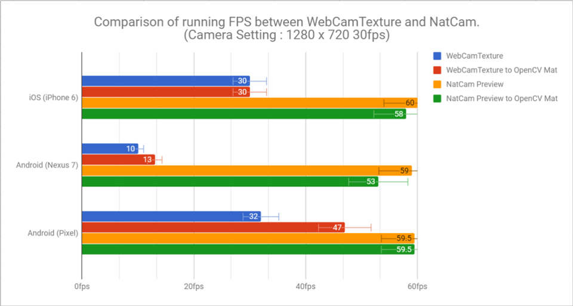
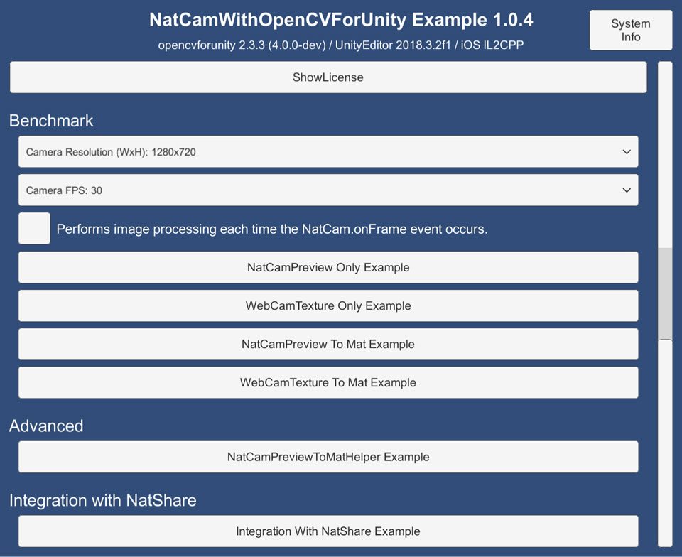
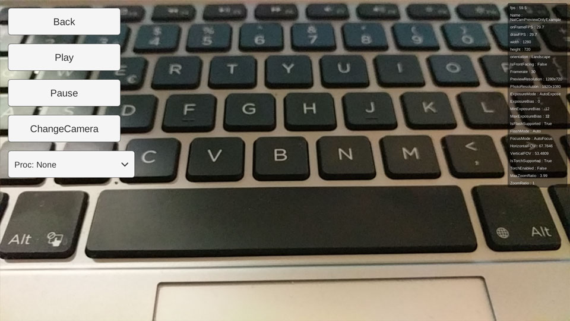
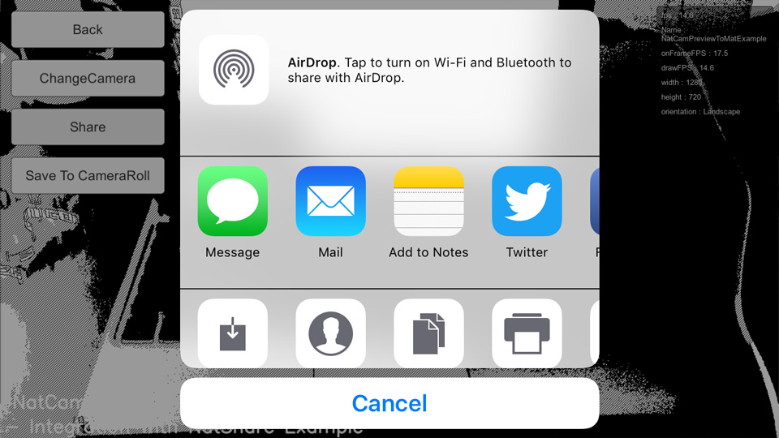

# NatCam With OpenCVForUnity Example
- An example of a benchmark test integrating NatCam and OpenCVForUnity. (Comparison between WebCamTexture and NatCam API)  
- An example of replacing WebCamTextureToMatHelper with NatCamPreviewToMatHelper.
- An example of native sharing and save to the camera roll using NatShare API.

<!--
## Benchmark
 
-->

## Environment
- Anddroid (Pixel, Nexus 7) / iOS (iPhone8, iPhone6s)
- Unity >= 2017.1+
- Scripting backend MONO / IL2CPP
- [NatCam - WebCam API](https://assetstore.unity.com/packages/tools/integration/natcam-pro-webcam-api-52154?aid=1011l4ehR) 2.3.0+
- [NatShare - Mobile Sharing API](https://assetstore.unity.com/packages/tools/integration/natshare-mobile-sharing-api-117705?aid=1011l4ehR) 1.1f3+
- [OpenCV for Unity](https://assetstore.unity.com/packages/tools/integration/opencv-for-unity-21088?aid=1011l4ehR) 2.3.7+

## Demo
- Android [NatCamWithOpenCVForUnityExample.apk](https://github.com/EnoxSoftware/NatCamWithOpenCVForUnityExample/releases)

## Setup
1. Download the latest release unitypackage. [NatCamWithOpenCVForUnityExample.unitypackage](https://github.com/EnoxSoftware/NatCamWithOpenCVForUnityExample/releases)
1. Create a new project. (NatCamWithOpenCVForUnityExample)
1. Import NatCam.
1. Import NatShare.
1. Import OpenCVForUnity.
    * Setup the OpenCVForUnity. (Tools > OpenCV for Unity > Set Plugin Import Settings)
1. Import the NatCamWithOpenCVForUnityExample.unitypackage.
1. Change the "Minimum API Level" to 21 or higher in the "Player Settings (Androd)" Inspector.
1. Change the "Target minimum iOS Version" to 11 or higher in the "Player Settings (iOS)" Inspector.
1. Add the "Assets/NatCamWithOpenCVForUnityExample/*.unity" files to the "Scenes In Build" list in the "Build Settings" window.
1. Build and Deploy to Android and iOS.

## ScreenShot
 
 
 
